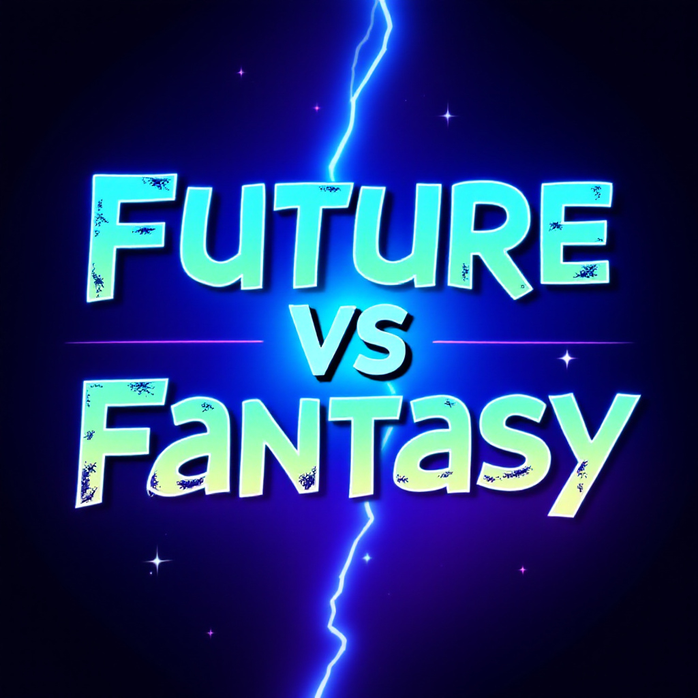
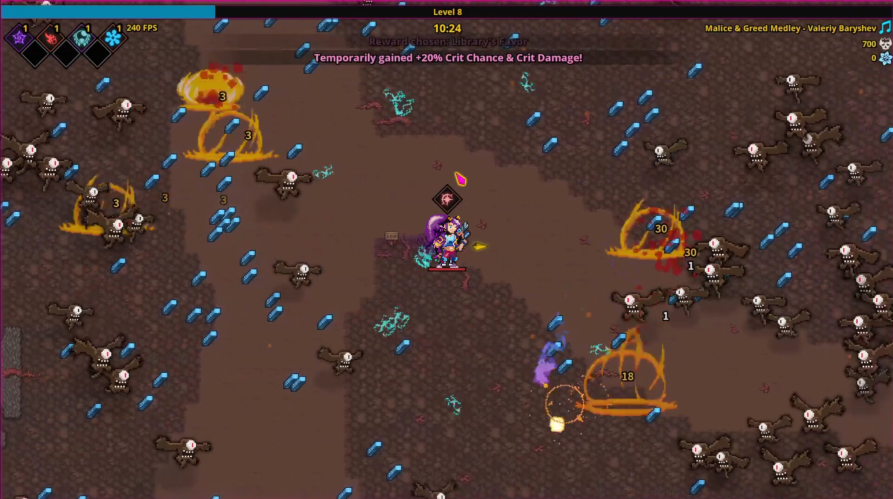
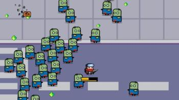

# 

## Índice

1. [Introducción](#introducción)
    - [Inspiración](#inspiración)
2. [Género y Plataforma](#género-y-plataforma)
3. [Historia y Ambientación](#historia-y-ambientación)
4. [Mecánicas de Juego](#mecánicas-de-juego)
5. [Controles](#controles)
6. [Personajes](#personajes)
7. [Armas y Habilidades](#armas-y-habilidades)
8. [Niveles y Mapas](#niveles-y-mapas)
9. [Sistema de Progresión](#sistema-de-progresión)
10. [Objetivo del Juego](#objetivo-del-juego)
11. [Aspectos Técnicos](#aspectos-técnicos)
12. [Música](#música)

---

## Introducción

Future vs Fantasy es un juego de acción y supervivencia inspirado principalmente en el estilo Vampire Survivors. El jugador controla a un personaje del futuro equipado con armas modernas que intenta viajar al pasado para cambiar el destino de la humanidad, pero por error acaba en otra dimensión y ahora debe enfrentarse a hordas de enemigos que habitan en un mundo de fantasía.

### Inspiración

- **Vampire Survivors**  
Posiblemente el precursor o referente de este género. No podía faltar como inspiración a mi juego. Aunque pretendo que mi juego tenga gráficos algo mejores, sería algo similar a esto.
# 

- **Spellbook Demonslayers**  
Juego muy similar al vampire survivors, pero más enfocado a la magia y ataques a distancia. Algo más moderno que el juego en el que se basa pero manteniendo esa esencia retro.
# 

- **Survivor.io**  
Juego para móvil con enfoque más moderno todavía donde controlas a un personaje que se defiende de hordas de zombies. Es muy adictivo y tiene varias combinaciones de armas y evoluciones finales de las mismas.
# 

**Pero son solo inspiraciones. No quiero que mi juego sea solo moverse y esquivar, pretendo que sea el jugador el q elija cuando sale el disparo y no que salga siempre automáticamente, para que sea un poco más divertido y controlable el juego, sin tanto caos pero con ese rollo.**

---

## Género y Plataforma

- **Género:** Roguelike, Bullet Hell, Supervivencia.  
- **Plataformas:** PC (posible adaptación a móvil en el futuro si me da tiempo).

---

## Historia y Ambientación

El protagonista es un viajero del tiempo cuyo objetivo era salvar a la humanidad del futuro que les espera, ya que está plagado de guerras por culpa de los fascistas, problemas sociales, pésimos gobernantes y líderes, mucha hambruna...Pero el problema es que los científicos e ingenieros calculan mal y ocurre un error en la matriz del transportador, provocando que nuestro viajero llegue por error a otro universo en lugar del pasado, un mundo dominado por seres fantásticos. Con su arsenal de armas modernas, debe sobrevivir y derrotar a las oleadas de enemigos mientras descubre cómo ha llegado ahí y busca una forma de regresar a su tiempo, o al menos, a su mundo.

---

## Mecánicas de Juego

- Movimiento en 360° (teclado).  
- Disparo manual en la dirección de movimiento del jugador.  
- Hordas de enemigos aumentando en dificultad con el tiempo.  
- Mejoras y habilidades adquiridas con la experiencia.  
- Recolección de objetos de mejora (salud, potenciadores).

---

## Controles

- **PC:** Teclas W-A-S-D o teclas de dirección para moverse, clic o barra espaciadora para disparar.  
- **Móvil (si lo desarrollo):** Joystick virtual para moverse, botón de disparo.

---

## Personajes

- **Protagonista:** Un viajero del tiempo armado con tecnología moderna.  
- **Enemigos:**
  - Caballeros medievales con espadas, arcos, escudos, lanzas..  
  - Orcos con gran resistencia y ataques cuerpo a cuerpo pesados.  
  - Magos que lanzan proyectiles mágicos.  
  - Esqueletos chungos y slimes.  
  - Bestias como hombres-lobo y hombres-oso.

---

## Armas y Habilidades

- **Armas cuerpo a cuerpo:** navajilla, bate de béisbol, espada.  
- **Pistola:** Disparo tiro a tiro. Variedad de pistolas.  
- **Fusiles:** Disparo de repetición. Variedad de fusiles.  
- **Escopeta:** Disparo con dispersión y gran potencia, pero corto alcance.  
- Al subir de nivel se podrá elegir o bien arma, o bien mejorar habilidades (más daño, mayor velocidad del pj, mayor protección…)

---

## Niveles y Mapas

- Habrá 3 mapas distintos, cada uno con su propio diseño y características.  
- Prado del rey: Al ser el primer mapa, quiero que sea clarito y sencillo.  
- *(Los otros mapas por determinar)*

---

## Sistema de Progresión

- Eliminar enemigos otorga experiencia.  
- Subida de nivel permite mejorar habilidades básicas o elegir nuevas armas.  
- Sistema de desbloqueo de mejoras permanentes.

---

## Objetivo del Juego

- Sobrevivir el mayor tiempo posible y acabar con el boss de cada zona mientras derrotas hordas de enemigos.  
- Implementación de tabla de líderes con las mejores puntuaciones y tiempos, conectado a una BBDD para poder guardar y mostrar esa información.

---

## Aspectos Técnicos

- **Motor:** Godot Engine.  
- **Conexión a BBDD:** MongoDB, con una API que implementaré basándome en la que ya tuvimos que realizar.  
- **Gráficos:** Pixel-art o 2.5D. Tendré que mezclar un poco debido al enfoque y mezcla de assets, pero manteniendo la máxima cohesión posible.  
- **Inteligencia Artificial:** Básica para enemigos con patrones de ataque, todos los enemigos cogen agro instantáneo, pero algunos atacarán de cerca, otros de lejos..

---

## Música

Quiero que sea una música que concuerde con el estilo de juego, así que posiblemente sea rock/metal, alomejor es un rock más tranquilo y cuando aparece el boss rompe una canción más fuerte, todavía por determinar.

