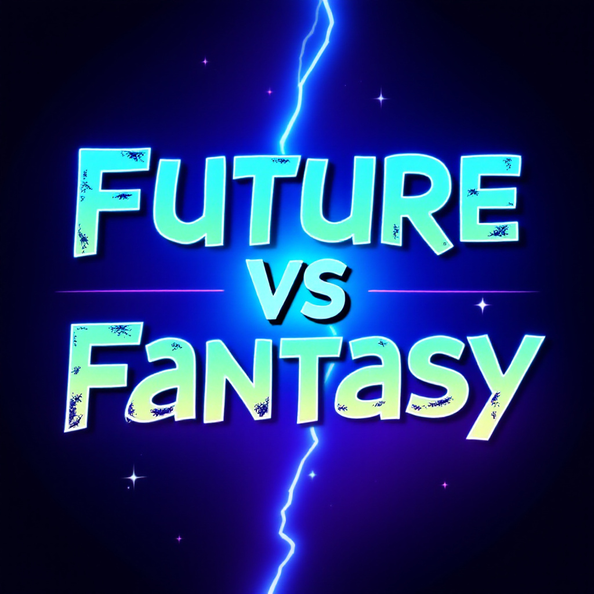
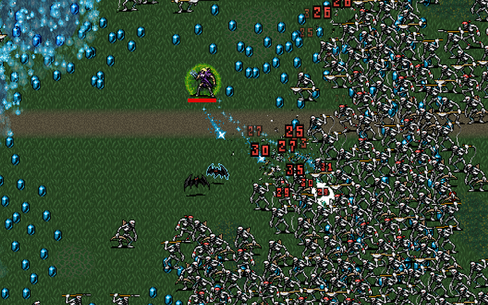
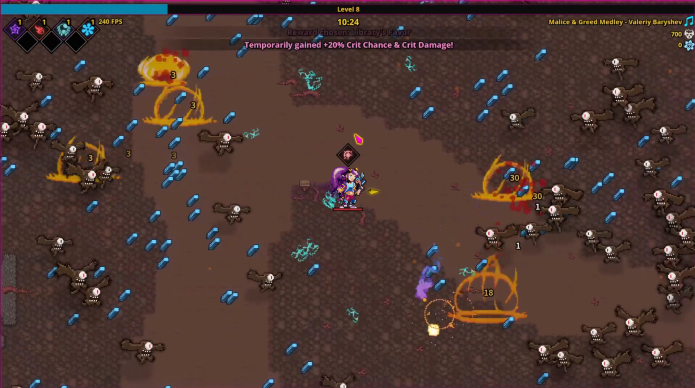
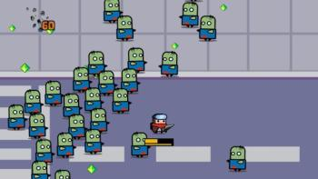

# 

## Índice

1. [Introducción](#introducción)
	- [Inspiración](#inspiración)
2. [Género y Plataforma](#género-y-plataforma)
3. [Historia y Ambientación](#historia-y-ambientación)
4. [Mecánicas de Juego](#mecánicas-de-juego)
5. [Controles](#controles)
6. [Personajes](#personajes)
7. [Armas y Habilidades](#armas-y-habilidades)
8. [Niveles y Mapas](#niveles-y-mapas)
9. [Sistema de Progresión](#sistema-de-progresión)
10. [Objetivo del Juego](#objetivo-del-juego)
11. [Aspectos Técnicos](#aspectos-técnicos)
12. [Música](#música)

---

## Introducción

Future vs Fantasy es un juego de acción y supervivencia inspirado principalmente en el estilo Vampire Survivors. El jugador controla a un personaje del futuro equipado con armas modernas que intenta viajar al pasado para cambiar el destino de la humanidad, pero por error acaba en otra dimensión y ahora debe enfrentarse a hordas de enemigos que habitan en un mundo de fantasía.

### Inspiración

- **Vampire Survivors**  
Posiblemente el precursor o referente de este género. No podía faltar como inspiración a mi juego.

# 

- **Spellbook Demonslayers**  
Juego muy similar al vampire survivors, pero más enfocado a la magia y ataques a distancia. Algo más moderno que el juego en el que se basa pero manteniendo esa esencia retro.

# 

- **Survivor.io**  
Juego para móvil con enfoque más moderno todavía donde controlas a un personaje que se defiende de hordas de zombies. Es muy adictivo y tiene varias combinaciones de armas y evoluciones finales de las mismas.
# 

**Pero son solo inspiraciones. No quiero que mi juego sea solo moverse y esquivar, pretendo que sea el jugador el que elija cuando sale el disparo y no que salga siempre automáticamente, para que sea un poco más divertido y controlable el juego, sin tanto caos pero con ese estilo.**

---

## Género y Plataforma

- **Género:** Roguelike, Bullet Hell, Supervivencia.  
- **Plataformas:** PC (posible adaptación a móvil en el futuro).

---

## Historia y Ambientación

El protagonista es un viajero del tiempo cuyo objetivo es salvar a la humanidad del futuro que les espera, ya que está plagado de guerras por culpa de los que ostentan el poder, problemas sociales, pésimos gobernantes y líderes, mucha hambruna...Pero hay un problema que los científicos e ingenieros calculan mal y ocurre un error en la matriz del transportador, provocando que nuestro viajero llegue por error a otro universo en lugar del pasado, un mundo dominado por seres fantásticos. Con su arsenal de armas modernas, debe sobrevivir y derrotar a las oleadas de enemigos mientras busca una forma de regresar a su tiempo, o al menos, a su mundo.

---

## Mecánicas de Juego

- Movimiento en 360° (teclado).  
- Disparo manual en la dirección del cursor del jugador. 
- Hordas de enemigos aumentando progresivamente la dificultad con el tiempo.
- Mejoras y habilidades adquiridas con la experiencia.  

---

## Controles

- **PC:** Teclas W-A-S-D o teclas de dirección para moverse, clic o barra espaciadora para disparar.  
- **Móvil (futuro desarrollo):** Joystick virtual para moverse, botón de disparo/disparo a la posición táctil.

---

## Personajes

- **Protagonista:** Un viajero del tiempo armado con tecnología moderna.  
- **Enemigos:**
  - Caballeros medievales con espadas, arcos, escudos, lanzas..  
  - Orcos con gran resistencia y ataque. 
  - Magos que lanzan proyectiles mágicos.  
  - Esqueletos terroríficos y slimes.  
  - Bestias como hombres-lobo y hombres-oso.

---

## Armas y Habilidades

- **Pistola:** Cadencia buena, daño reducido al ser el arma más básica.
- **Subfusil:** Cadencia muy alta, daño bajo que se compensa con la cantidad de balas por segundo.
- **Fusiles:** Cadencia buena, daño más elevado.
- **Escopeta:** Cadencia baja, daño elevado y disparo con dispersión de los proyectiles. 
- Al subir de nivel se podrá elegir o bien arma, o bien mejorar habilidades (más daño o velocidad de movimiento)

---

## Niveles y Mapas

Hay 3 mapas distintos, cada uno con su propio diseño y características:

- **MeadowLands:**  Al ser el primer mapa, quiero que sea claro y sencillo.  
- **MisteryWoods:** Los bosques misteriosos, este mapa es algo más complejo y tétrico, con referencias más oscuras. Los enemigos son esqueletos.
- **FinalZone:** La zona final, este es el nivel más difícil, los enemigos tienen más vida, daño, velocidad y hay mayor cantidad. Son  orcos, bestias y magos para darle un plus de dificultad con un enemigo que lanza proyectiles más fuertes.

---

## Sistema de Progresión

- Eliminar enemigos hace que suelten un cristal, que dependiendo del color dará más o menos experiencia al recolectarlo.
- Subida de nivel que permite mejorar habilidades básicas como la vida o velocidad de movimiento o bien cambiar tu arma actual por una mejor.

---

## Objetivo del Juego

- Sobrevivir eliminando enemigos para poder subir nivel,  mejorar tu personaje y así poder aguantar los 10 minutos que dura cada nivel.

---

## Aspectos Técnicos

- **Motor:** Godot Engine.  
- **Conexión a BBDD:** MongoDB mediante una API sencilla. [Enlace de la API](https://github.com/Ang3l1llo/API_PSP)
Solamente una colección llamada players(jugadores) que almacena los nombres de los jugadores y sus puntuaciones.
- **Gráficos:** pixel-art . Hay una mezcla de assets de diferentes autores, coherente con mi estilo de juego. 
- **Inteligencia Artificial:** muy básica para los enemigos. Nada más “spawnear” van directos hacia el personaje, realizando ataques aleatorios entre los posibles que tienen.

---

## Música

Cada nivel tiene 3 canciones diferentes, la primera es siempre la más “suave” o tranquila, la segunda es un poco más intensa y la tercera es la más potente para realzar esos momentos de tensión en los últimos minutos de cada nivel en los que es más difícil sobrevivir. En cuanto a los estilos se mezcla una **electrónica** tipo 8 bits, **rock and roll** y **heavy metal**.
